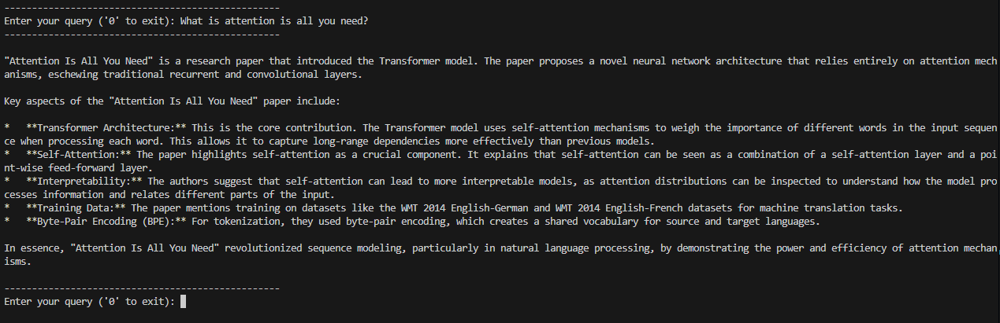

# RAG Chatbot: Attention Is All You Need PDF

This project is a **Retrieval-Augmented Generation (RAG) chatbot** built in Python. It allows you to query the "Attention Is All You Need" paper directly from the terminal. The chatbot leverages **LangChain**, **ChromaDB**, and **all-MiniLM-L6-v2 embeddings** to provide relevant answers using a **Google Gemini Flash 2.5 Lite LLM**.



---

## Features

* Reads PDFs and splits them into manageable chunks
* Stores embeddings in **ChromaDB** for fast retrieval
* Uses a retriever to fetch relevant chunks for any query
* Connects to Google Gemini LLM for natural language answers
* Works entirely from the terminal

---

## Setup

1. Clone the repository.
2. Install dependencies:

```bash
pip install langchain langchain-google-genai google-genai chromadb pypdf python-dotenv sentence-transformers langchain-community
```

3. Add your Google API key in a `.env` file:

```text
GOOGLE_API_KEY="<YOUR GOOGLE API KEY>"
```

4. Place the PDF you want to query (e.g., `attention_is_all_you_need.pdf`) in the data folder and change the `PDF_FILE_PATH` in the `main.py` to point to your pdf.

NOTE: A PDF file is already provided to you in the data folder.

---

## Usage

1. Load and split the PDF.
2. Embed and store chunks in **ChromaDB**.
3. Create a retriever from the vector store.
4. Attach the retriever to the Google Gemini Flash 2.5 Lite LLM.
5. Query the chatbot from the terminal:

```python
while True:
    print("-"*50)
    query = input("Enter your query ('0' to exit): ")
    print("-"*50)
    print()
    if query == "0":
        break
    
    llm_response = qa_chain.invoke(query)
    print(llm_response['result'])
    print()
```

---

## Author

Muhammad Armghan Baig Baig

[LinkedIn](https://www.linkedin.com/in/armghan-baig)
